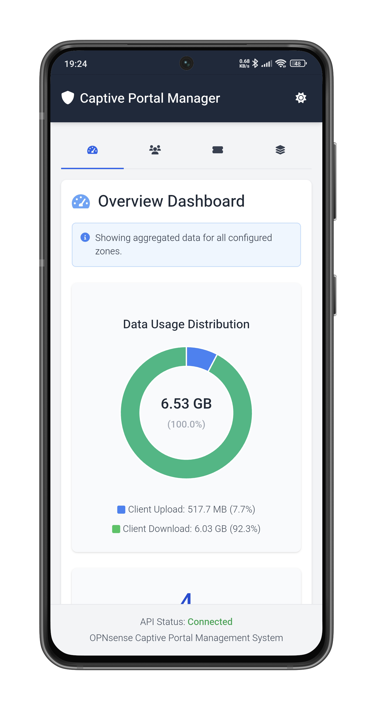
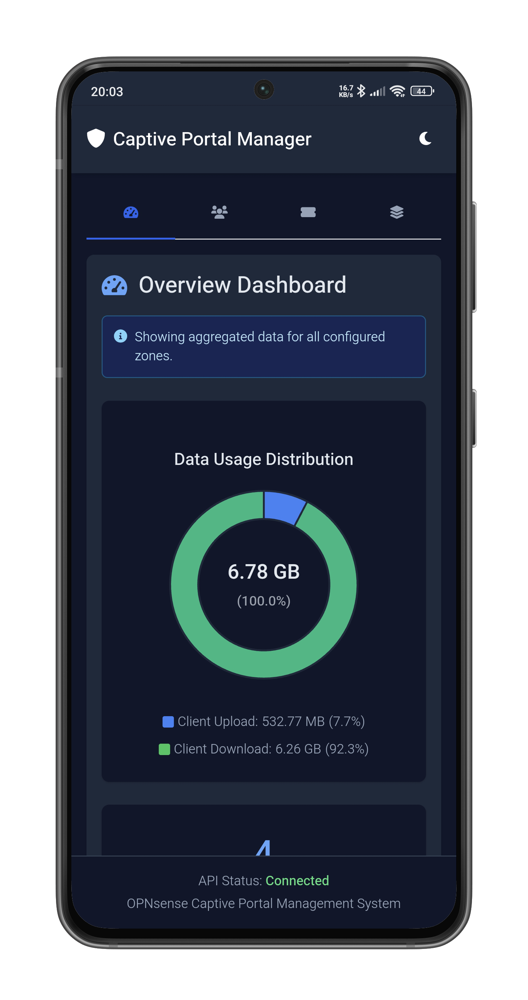
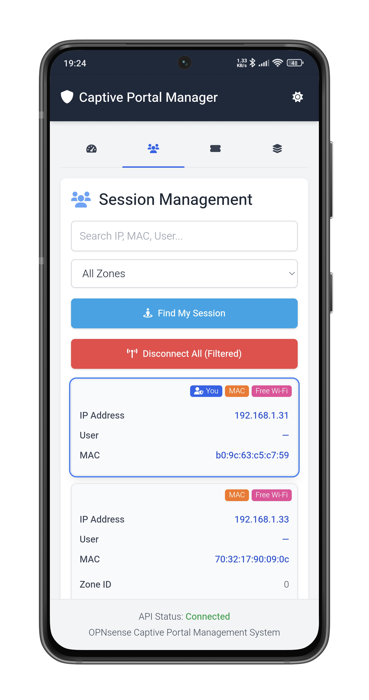
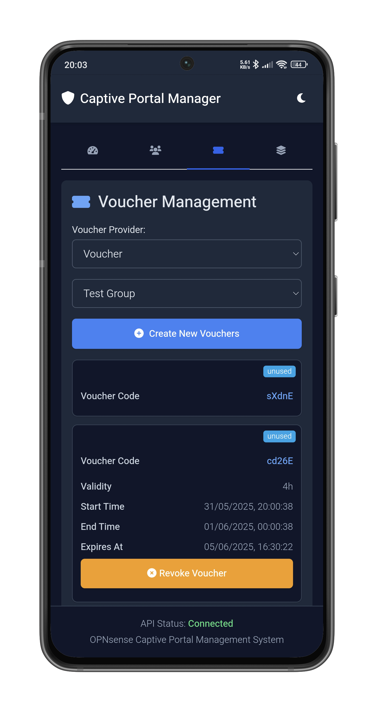
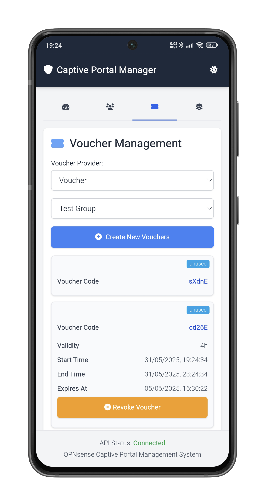
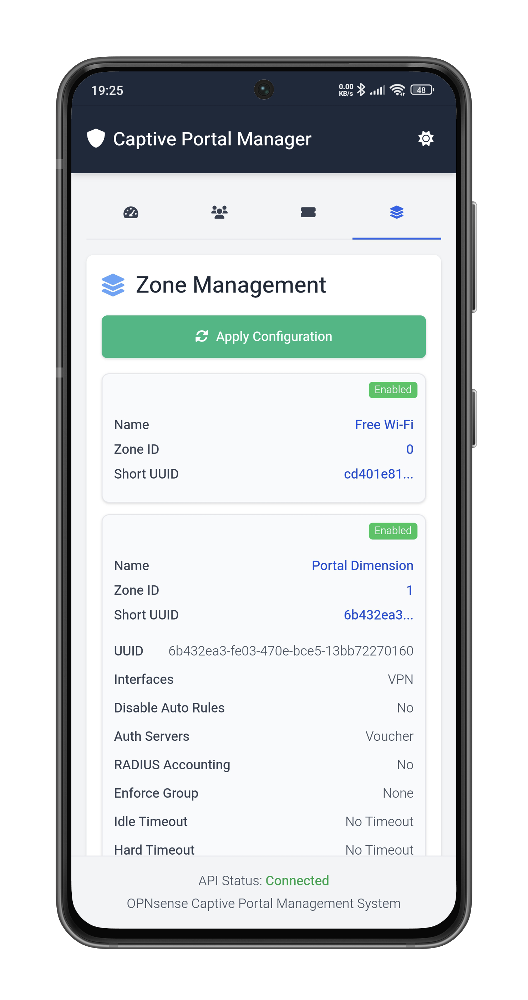
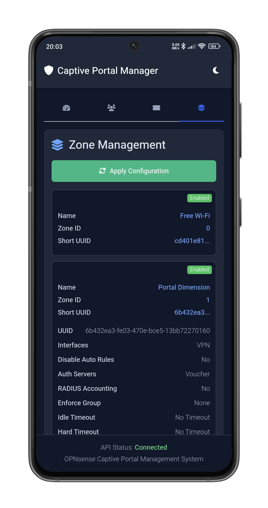
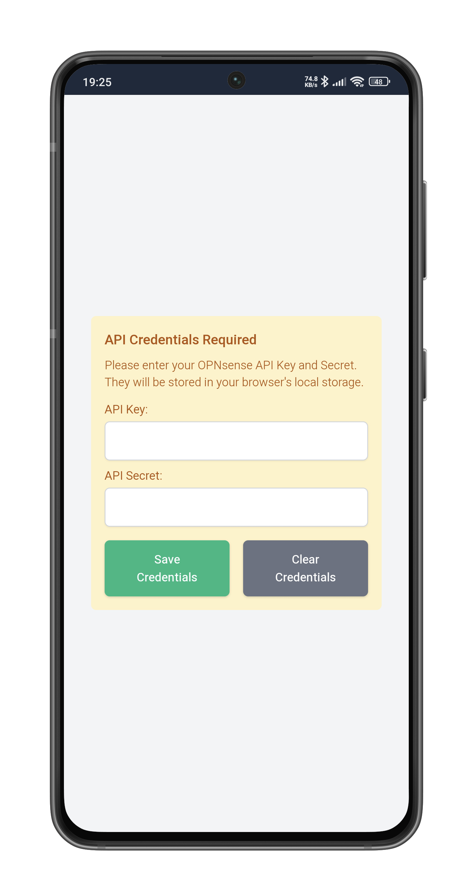
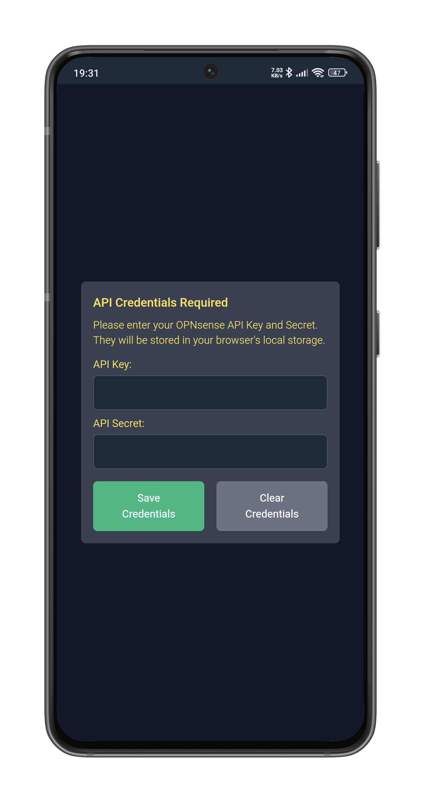

# Captive Portal Manager

**OPNsense Captive Portal Manager** is a web-based tool designed to manage the OPNsense Captive Portal, providing a user-friendly interface for monitoring and controlling various aspects of the portal.

## Features

* **Dashboard Overview**: Displays aggregated data for all configured zones, including a data usage distribution chart showing client upload and download statistics.
* **Session Management**: Allows viewing and managing active sessions. Users can search sessions by IP, MAC, or username, filter by zone, find their own session, and disconnect all (filtered) sessions.
* **Voucher Management**: Enables the creation and management of vouchers. Users can select a voucher provider, view voucher groups, create new vouchers with customizable counts and validity periods, and drop expired vouchers or entire voucher groups.
* **Zone Management**: Provides an interface for viewing and managing captive portal zones. Users can apply captive portal configurations and edit zone details such as status (enabled/disabled), description, allowed addresses, and allowed MAC addresses.
* **API Credential Management**: Securely stores OPNsense API Key and Secret in the browser's local storage for API interaction.
* **Theme Switching**: Supports light, dark, and system preference themes for an adaptable user interface.
* **Responsive Design**: Utilizes Tailwind CSS for a responsive layout suitable for various screen sizes.
* **Progressive Web App (PWA)**: Includes a service worker for caching app shell resources (`index.html`, icons) and a manifest file for "add to home screen" functionality.

## Mobile Screenshots

Here's a glimpse of how the Captive Portal Manager looks on mobile devices in both light and dark modes:

<div style="display: flex; flex-wrap: wrap; justify-content: space-around; align-items: flex-start;">
  <div style="text-align: center; margin: 10px; padding: 5px; width: 100%; max-width: 630px;">
    <b>1. Dashboard View</b><br>
    <div style="display: flex; justify-content: space-around; align-items: flex-start; margin-top: 5px; flex-wrap: wrap;">
        
        
    </div>
  </div>
  <div style="text-align: center; margin: 10px; padding: 5px; width: 100%; max-width: 630px;">
    <b>2. Active Sessions List</b><br>
    <div style="display: flex; justify-content: space-around; align-items: flex-start; margin-top: 5px; flex-wrap: wrap;">
        
        
    </div>
  </div>
  <div style="text-align: center; margin: 10px; padding: 5px; width: 100%; max-width: 630px;">
    <b>3. Voucher Creation/Management</b><br>
    <div style="display: flex; justify-content: space-around; align-items: flex-start; margin-top: 5px; flex-wrap: wrap;">
        
        
    </div>
  </div>
  <div style="text-align: center; margin: 10px; padding: 5px; width: 100%; max-width: 630px;">
    <b>4. Zone Information Display</b><br>
    <div style="display: flex; justify-content: space-around; align-items: flex-start; margin-top: 5px; flex-wrap: wrap;">
        
        
    </div>
  </div>
  <div style="text-align: center; margin: 10px; padding: 5px; width: 100%; max-width: 630px;">
    <b>5. API Credential Input Screen</b><br>
    <div style="display: flex; justify-content: space-around; align-items: flex-start; margin-top: 5px; flex-wrap: wrap;">
        
        
    </div>
  </div>
</div>

## Requirements

* An operational OPNsense® firewall.
* The OPNsense Captive Portal module configured for at least one zone.
* The OPNsense API enabled, with an API Key and Secret generated that have sufficient permissions for captive portal and voucher management. Navigate your `OPNsense > System > Access > Users`.
* Network connectivity from the device running this tool to the OPNsense API endpoint (ensure the `apiBaseUrl` in `app-config.json` is reachable).
* A modern web browser (e.g., Chrome, Firefox, Safari, Edge) that supports JavaScript, localStorage, and Service Workers for PWA functionality.

## Setup and Usage

1.  Clone or download the repository.
2.  Modify `app-config.json` to point to your OPNsense API endpoint.
3.  Open `index.html` in a modern web browser.
4.  Enter your OPNsense API credentials when prompted.
5.  Use the navigation tabs (Dashboard, Sessions, Vouchers, Zones) to manage your captive portal.

## Configuration

1.  **API Endpoint**: The base URL for the OPNsense API is configured in `app-config.json`. Make sure this points to your OPNsense instance (e.g., `https://192.168.1.1` or your specific OPNsense IP/hostname).
    ```json
    {
      "apiBaseUrl": "https://192.168.1.1"
    }
    ```
2.  **API Credentials**: Upon first launch, the application will prompt for your OPNsense API Key and Secret. These are stored in the browser's local storage.

## Service Worker

The application uses a service worker (`sw.js`) to cache the core application shell (e.g., `index.html`, icons). This allows for faster load times on subsequent visits.

## Technologies Used

*  [HTML](https://developer.mozilla.org/en-US/docs/Web/HTML)
*  [Tailwind CSS](https://tailwindcss.com/) (Theming)
*  [JavaScript](https://developer.mozilla.org/en-US/docs/Web/JavaScript)
*  [Chart.js](https://www.chartjs.org/) (Dashboard data visualization)
*  [Font Awesome](https://fontawesome.com/) (Icons)
*  [OPNsense API](https://docs.opnsense.org/development/api.html) (Interact with OPNsense)
