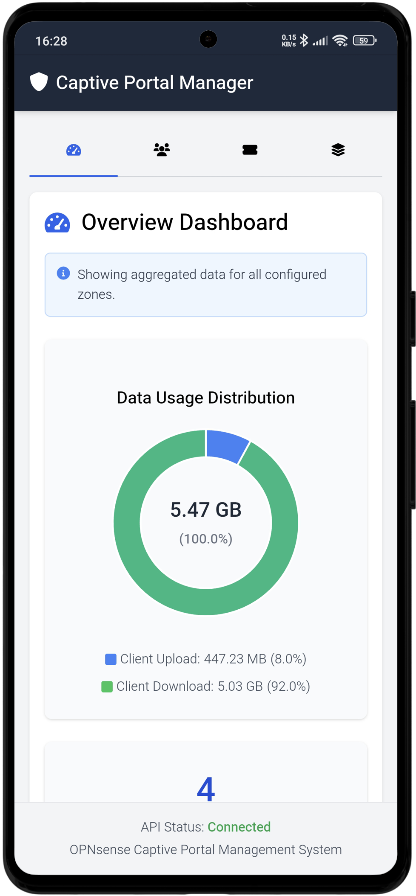
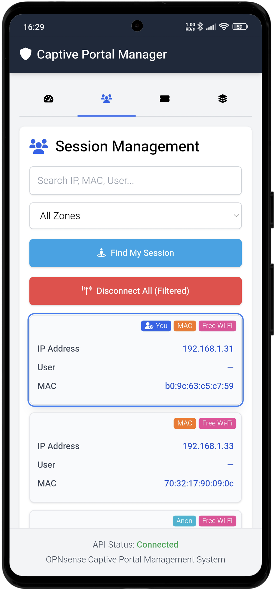
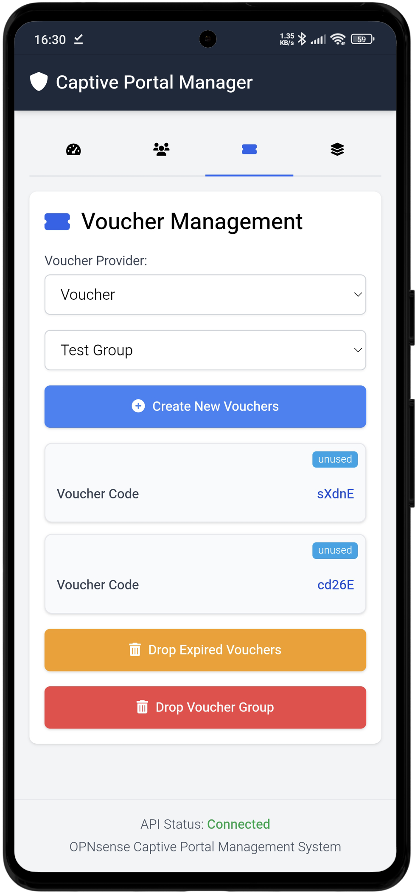
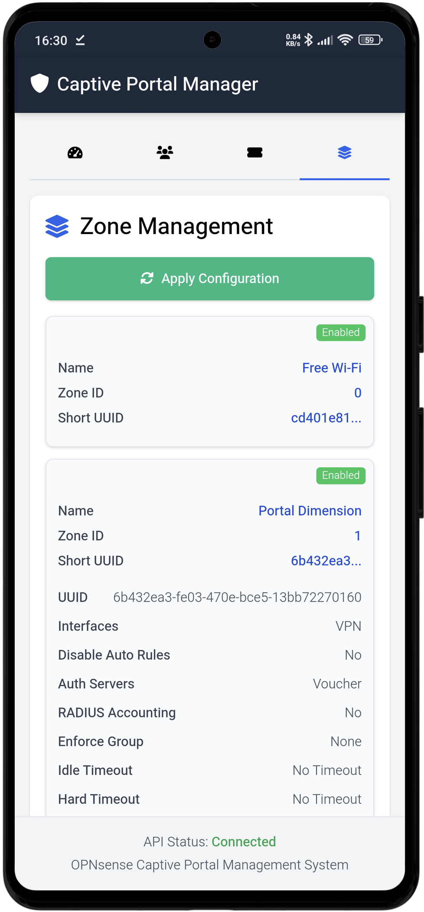
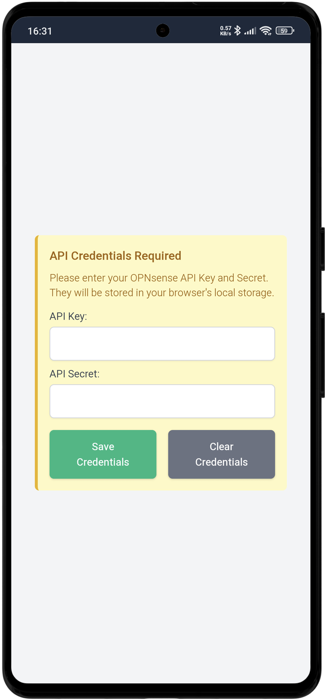

# Captive Portal Manager

**OPNsense Captive Portal Manager** is a web-based tool designed to manage the OPNsense Captive Portal, providing a user-friendly interface for monitoring and controlling various aspects of the portal.

## Features

* **Dashboard Overview**: Displays aggregated data for all configured zones, including a data usage distribution chart showing client upload and download statistics.
* **Session Management**: Allows viewing and managing active sessions. Users can search sessions by IP, MAC, or username, filter by zone, find their own session, and disconnect all (filtered) sessions.
* **Voucher Management**: Enables the creation and management of vouchers. Users can select a voucher provider, view voucher groups, create new vouchers with customizable counts and validity periods, and drop expired vouchers or entire voucher groups.
* **Zone Management**: Provides an interface for viewing and managing captive portal zones. Users can apply captive portal configurations and edit zone details such as status (enabled/disabled), description, allowed addresses, and allowed MAC addresses.
* **API Credential Management**: Securely stores OPNsense API Key and Secret in the browser's local storage for API interaction.
* **Responsive Design**: Utilizes Tailwind CSS for a responsive layout suitable for various screen sizes.
* **Progressive Web App (PWA)**: Includes a service worker for caching app shell resources (`index.html`, icons) and a manifest file for "add to home screen" functionality.

## Mobile Screenshots

Here's a glimpse of how the Captive Portal Manager looks on mobile devices:

<div style="display: flex; flex-wrap: wrap; justify-content: space-around; align-items: flex-start;">
  <div style="text-align: center; margin: 10px; padding: 5px;">
    <b>1. Dashboard View</b><br>
    
  </div>
  <div style="text-align: center; margin: 10px; padding: 5px;">
    <b>2. Active Sessions List</b><br>
    
  </div>
  <div style="text-align: center; margin: 10px; padding: 5px;">
    <b>3. Voucher Creation/Management</b><br>
    
  </div>
  <div style="text-align: center; margin: 10px; padding: 5px;">
    <b>4. Zone Information Display</b><br>
    
  </div>
  <div style="text-align: center; margin: 10px; padding: 5px;">
    <b>5. API Credential Input Screen</b><br>
    
  </div>
</div>


## Configuration

1.  **API Endpoint**: The base URL for the OPNsense API is configured in `app-config.json`.
    ```json
    {
      "apiBaseUrl": "https://opnsense.example.com"
    }
    ```
2.  **API Credentials**: Upon first launch, the application will prompt for your OPNsense API Key and Secret. These are stored in the browser's local storage.

## Technologies Used

* HTML
* Tailwind CSS
* JavaScript
* Chart.js (for dashboard data visualization)
* Font Awesome (for icons)
* OPNsense API

## Setup and Usage

1.  Clone or download the repository.
2.  Ensure the `app-config.json` points to your OPNsense API endpoint.
3.  Open `index.html` in a modern web browser.
4.  Enter your OPNsense API credentials when prompted.
5.  Use the navigation tabs (Dashboard, Sessions, Vouchers, Zones) to manage your captive portal.

## Service Worker

The application uses a service worker (`sw.js`) to cache the core application shell (e.g., `index.html`, icons). This allows for faster load times on subsequent visits and provides a basic offline experience. The cache is versioned (currently `captive-portal-manager-cache-v0.1.2`), and the service worker will automatically update and clean up old caches when a new version is deployed.
