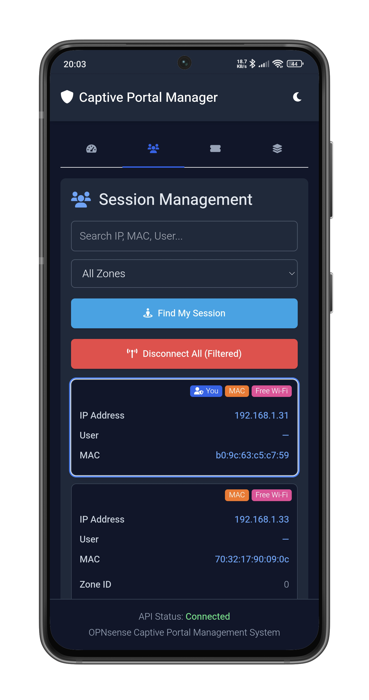

# Captive Portal Manager

**OPNsense Captive Portal Manager** is a web-based tool designed to manage the OPNsense Captive Portal, providing a user-friendly interface for monitoring and controlling various aspects of the portal.

## Features

- **Dashboard Overview**: Displays aggregated data for all configured zones, including a data usage distribution chart showing client upload and download statistics.
- **Session Management**: Allows viewing and managing active sessions. Users can search sessions by IP, MAC, or username, filter by zone, find their own session, and disconnect selected sessions.
- **Voucher Management**: Enables the creation and management of vouchers. Users can select a voucher provider, view voucher groups, create new vouchers with customizable counts and validity periods, and drop expired vouchers or entire voucher groups.
- **Zone Management**: Provides an interface for viewing and managing captive portal zones. Users can apply captive portal configurations and edit zone details such as status, description, timeouts, authentication servers, and more.
- **API Credential Management**: Securely stores OPNsense API Key, Secret, and Base URL in the browser's local storage for API interaction.
- **Theme Switching**: Supports light, dark, and system preference themes for an adaptable user interface.
- **Notifications**: Provides local desktop notifications for new user sign-ins.
- **Responsive Design**: Utilizes Tailwind CSS for a responsive layout suitable for various screen sizes.
- **Progressive Web App (PWA)**: Includes a service worker for caching and "add to home screen" functionality.

## Mobile Screenshots

Here's a glimpse of how the Captive Portal Manager looks on mobile devices in both light and dark modes:

<div style="display: flex; flex-wrap: wrap; justify-content: space-around; align-items: flex-start;">
  <div style="text-align: center; margin: 10px; padding: 5px; width: 100%; max-width: 630px;">
    <b>1. Dashboard View</b><br>
    <div style="display: flex; justify-content: space-around; align-items: flex-start; margin-top: 5px; flex-wrap: wrap;">
        
        
    </div>
  </div>
  <div style="text-align: center; margin: 10px; padding: 5px; width: 100%; max-width: 630px;">
    <b>2. Active Sessions List</b><br>
    <div style="display: flex; justify-content: space-around; align-items: flex-start; margin-top: 5px; flex-wrap: wrap;">
        
        
    </div>
  </div>
  <div style="text-align: center; margin: 10px; padding: 5px; width: 100%; max-width: 630px;">
    <b>3. Voucher Creation/Management</b><br>
    <div style="display: flex; justify-content: space-around; align-items: flex-start; margin-top: 5px; flex-wrap: wrap;">
        
        
    </div>
  </div>
  <div style="text-align: center; margin: 10px; padding: 5px; width: 100%; max-width: 630px;">
    <b>4. Zone Information Display</b><br>
    <div style="display: flex; justify-content: space-around; align-items: flex-start; margin-top: 5px; flex-wrap: wrap;">
        
        
    </div>
  </div>
  <div style="text-align: center; margin: 10px; padding: 5px; width: 100%; max-width: 630px;">
    <b>5. API Credential Input Screen</b><br>
    <div style="display: flex; justify-content: space-around; align-items: flex-start; margin-top: 5px; flex-wrap: wrap;">
        
        
    </div>
  </div>
</div>

## Requirements

- An operational OPNsense® firewall.
- The OPNsense Captive Portal module configured for at least one zone.
- The OPNsense API enabled, with an `API Key` and `Secret` generated that have sufficient permissions for captive portal and voucher management.
- Network connectivity from the device running this tool to the OPNsense API endpoint.
- A modern web browser (e.g., Chrome, Firefox, Safari, Edge).

## Installation

The recommended way to install the Captive Portal Manager is by deploying the pre-built release files. For OPNsense users, hosting it on the firewall itself is the easiest method.

1.  **Download**: Go to the **[Releases page](https://github.com/halimstt/cpmanager/releases)** of this project and download the latest `cpmanager-vX.X.X.zip` file.
2.  **Unzip**: Create a folder for it, eg: `cpmanager`. Extract the zip file into this folder.
3.  **Upload**:
    - **(Recommended on OPNsense)**: Upload the entire folder to your OPNsense firewall's web server root, located at `/usr/local/www/`.
    - **(Alternative on external server)**: Upload the folder to the root of any other web server. Please see the **Troubleshooting** section regarding CORS if you choose this method.
4.  **Access**: Open your web browser and navigate to the application URL (e.g., `https://192.168.1.1/cpmanager/`).
5.  **Configure Credentials**: On first launch, the app will prompt for your API Base URL, Key, and Secret.

## Configuration

Before configuring the app you need to have API `Key` and `Secret`. To generate the API Key and Secret, you need to go to your OPNsense WebUI, then navigate to `System > Access > Users`, and look for the icon that says 'API' (it looks like a ticket icon).

The application can be configured in two ways:

### 1. In-App Configuration

The primary method for configuration is through the application's user interface.

- **API Credentials & Base URL**: On first use, the app will prompt for your API Base URL, Key, and Secret.
- **Persistence**: All settings configured in the UI are saved to your browser's **local storage**. These values will always **override** any settings present in the `app-config.json` file. To re-enter credentials, click the "API Status" text in the footer.

### 2. Pre-deployment Configuration (Optional)

You can edit the `app-config.json` file located inside the `cpmanager` folder to set default values. This is useful for pre-configuring the application.

```json
{
  "apiBaseUrl": "https://192.168.1.1",
  "inMemoryCacheTTLMinutes": 1,
  "itemsPerPage": 6
}
```

- **`apiBaseUrl`**: Sets the default URL for your OPNsense API endpoint.
- **`itemsPerPage`**: Changes the number of items displayed per page in the Sessions, Vouchers, and Zones tabs.

---

## For Developers

<details><summary>If you want to modify the source code:</summary>

1.  **Clone Repository**:
    ```sh
    git clone https://github.com/halimstt/cpmanager.git
    cd cpmanager
    ```
2.  **Install Dependencies**:
    ```sh
    npm install
    ```
3.  **Run Development Server**:
    ```sh
    npm start
    ```
4.  **Build for Production**: To create a production-ready build in the `dist/` directory:
    ```sh
    npm run build
    ```

### Icon System (Font Awesome SVG with JavaScript)

This project utilizes Font Awesome's SVG icons. For developers, there are two critical steps to using and interacting with icons:

1.  Add New Icons to the Library: To make a new icon available in the application, you must perform two actions in `src/js/main.js`:

    - First, import the specific icon from the `@fortawesome/free-solid-svg-icons` package (e.g., `import { faNewIcon } from '@fortawesome/free-solid-svg-icons'`).
    - Then, add your imported icon to the `library.add()` function call.

2.  Target the `<svg>` Tag for Scripting: When writing JavaScript to interact with an icon (e.g., adding a `click` listener), always target the final `<svg>` element, not the initial `<i>` tag. The `dom.watch()` function removes the `<i>` tag and replaces it with an `<svg>`.

    - Incorrect: `document.querySelector('i.fa-some-icon')`
    - Correct: `document.querySelector('svg.fa-some-icon')`

</details>

---

## Troubleshooting

<details><summary>If you encounter "Failed to fetch" errors or "Cannot reach OPNsense API" messages, you are likely experiencing a Cross-Origin Resource Sharing (CORS) issue.</summary>

**What is CORS?**
CORS is a browser-level security mechanism that prevents a web page loaded from one origin (domain, protocol, and port) from making requests to a resource on a _different_ origin unless the server explicitly grants permission.

**How to resolve:**

- **Option 1: Easiest Setup (Recommended)**:
  Host this application directly within a subfolder on your OPNsense web server (e.g., `/usr/local/www/cpmanager/`). When the app is served from the same domain/IP as the OPNsense API, browser security policies will not block requests.

- **Option 2: Configure OPNsense for CORS (for external hosting)**:
  If you host this application on a separate server, you must configure your OPNsense firewall to allow requests from your application's origin. This involves adding CORS headers to OPNsense's web server configuration. Refer to the official OPNsense documentation on API access and CORS settings for instructions on how to add "Allowed Origins".

**Common Symptoms of CORS issues**:

- "Failed to fetch" errors in the browser console.
- Console messages like "Access to XMLHttpRequest at '...' from origin '...' has been blocked by CORS policy".
- The application gets stuck on "Initializing..." or continuously shows "Connection Failed".

</details>

---

## Vouchers

<details><summary>Learn how to configure OPNsense and use the tool to generate vouchers.</summary>

**Important Prerequisites for Voucher Functionality in OPNsense**:

1.  **Create a Voucher Authentication Server**:

- In OPNsense, navigate to **System > Access > Servers**.
- Click `+` (Add) to create a new server. Set the `Type` to **"Vouchers"** and give it a descriptive `Name` (e.g., "GuestVouchers"). This name will appear as the "Voucher Provider" in this tool.

2.  **Configure Your Captive Portal Zone**:

- Navigate to **Services > Captive Portal > Administration**.
- Edit the zone where you will use vouchers.
- In the zone's configuration, select the Voucher authentication server you just created as the **Authentication method**.
- Save and **Apply** changes.

---

**How to Generate Vouchers in this Tool**:

1.  Navigate to the **"Vouchers" tab**.
2.  Select your configured **Voucher Provider**.
3.  Click the **"Create New Vouchers"** button.
4.  In the dialog, configure the voucher parameters (count, validity, expiration, group name, output format).
5.  Choose output type and click **"Generate"**. A PDF file containing the new voucher codes will be downloaded automatically.

</details>

---

## Service Worker

The application uses a service worker (`sw.js`):

- To cache the core application shell (e.g., `index.html`, icons) for faster load times and potential offline access.
- To handle and display desktop notifications for new user sign-ins.
- To manage notification click events, allowing users to open the application when a notification is clicked.

---

## Technologies Used

-  [HTML](https://developer.mozilla.org/en-US/docs/Web/HTML)
-  [Tailwind CSS](https://tailwindcss.com/)
-  [JavaScript](https://developer.mozilla.org/en-US/docs/Web/JavaScript)
-  [Chart.js](https://www.chartjs.org/)
-  [Font Awesome](https://fontawesome.com/)
-  [OPNsense API](https://docs.opnsense.org/development/api.html)
-  [Webpack](https://webpack.js.org/)
